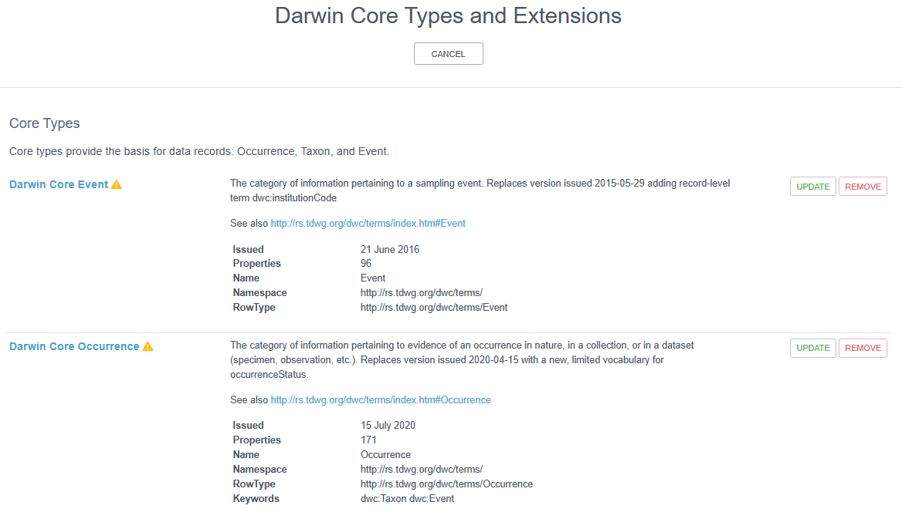

## IPT Administration Responsibilities

If you are an IPT administrator, you are responsible for:

1. Creating the IPT
2. Registering IPT with OBIS and GBIF
3. Keeping the IPT up to date
4. Describing, checking and uploading the data and metadata to the IPT
5. Guide data providers to publish the data and metadata to the IPT themselves
6. Make sure all relevant information and data for OBIS is available
7. Perform necessary quality checks before the data are released to OBIS

### Creating and Installing IPTs

OBIS nodes can decide to install and manage their IPT on their own institutional servers or use (at no charge!) the OBIS servers in Oostende, Belgium, provided as in-kind by the Flanders Marine Institute (VLIZ), which also runs the European OBIS node (EurOBIS). VLIZ also ensures the IPT instances run on the latest version (important for security updates). Here is an overview of the IPT instances hosted in Oostende: [http://ipt.iobis.org/](http://ipt.iobis.org/). Please contact the secretariat at info@iobis.org if you would like OBIS to host your IPT.

To install your own IPT, please follow the instructions in the [GBIF IPT manual](https://github.com/gbif/ipt/wiki/IPT2ManualNotes.wiki#getting-started-guide).

### Registration

When you have installed your IPT, please provide the IPT instance URL to the OBIS secretariat (helpdesk@obis.org), so your IPT is included in the data harvesting process.

OBIS recommends to share the data as widely as possible including with other networks such as GBIF. On 13 October 2014, a cooperation agreement was signed between the secretariats of IOC-UNESCO/OBIS and GBIF in which the two parties recognized the two initiatives (OBIS and GBIF) as complementary with common goals (and in particular OBIS’s role in Marine Biodiversity Data). Together they agreed to work towards maximizing the quantity, quality, completeness and fitness for use of marine biodiversity data, accessible through OBIS and GBIF and in particular in the development of data standards (DwC), technology (IPT), maximizing fitness for use, development of biodiversity indicators for assessments, enhance capacity through training and coordinate approaches to the global science/policy interface. At the 4th session of the OBIS Steering Group (SG-OBIS-IV, Feb 2015), it was recommended that GBIF should harvest OBIS tier 2 nodes if OBIS tier 2 nodes could also harvest marine datasets from their GBIF nodes. In this way OBIS could work directly with the entire marine community and promote its standards and best practices. It was not recommended that iOBIS set up a separate IPT for GBIF to harvest, since this would mean a duplication of effort.

In order to publish data with GBIF, the OBIS node also needs to become a [data publisher in GBIF](https://www.gbif.org/become-a-publisher), and link the IPT installation with this publishing organization. OBIS nodes are encouraged to use the OBIS node name as the publishers's name, unless the host institution requires its institutional name to be used. In the latter case, reference to the OBIS node can be added in the description, as well as between brackets in the title. The name of the IPT instance can also refer to the OBIS node. OBIS nodes are also encouraged to select OBIS as the endorsing organization. In this way, the OBIS node is also listed on the [OBIS page](https://www.gbif.org/participant/304) at GBIF.

We have created this short video to help guide you on registering your OBIS node IPT with GBIF.

### Maintaining the IPT

As the IPT administrator, you must make sure the IPT is kept up to date, datasets (resources) are published in a timely manner, add, edit, or delete IPT users as required, register with GBIF as applicable, and configure the types of cores and extensions accepted by the IPT.

To add or update extensions, navigate to the Darwin Core Types and Extensions page from the Administration menu. To install an extension (e.g., DNA Derived Data), simply scroll down the page and click the `Install` button to the right of the desired extension.

{width=70%}

For extensions already installed, you may notice yellow flags indicating a core or extension is out of date. You can update these easily by clicking the `Update` button.

{width=70%}

For a detailed breakdown of administrator options, see the [IPT guide](https://github.com/gbif/ipt/wiki/IPT2ManualAdministration.wiki#administration-menu).
